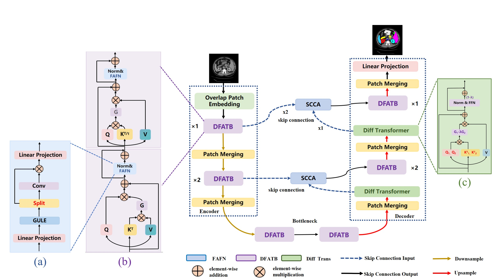

# [DFAFomrer: Dual Feature Aggregation Transformer for Medical Image Segmentation]




## Updates

- 2025


### Datasets
Download the Synapse dataset from [here](https://drive.google.com/uc?export=download&id=18I9JHH_i0uuEDg-N6d7bfMdf7Ut6bhBi).


### Training and Testing

1) Run the following code to install the requirements.

    `pip install -r requirements.txt`

2) Run train.py 
    ```bash
    python train.py --batch_size 20 --max_epochs 580 --eval_interval 20 --module networks.DFAFormer.DFAFormer
    ```

 3) Run test.py
    ```bash
    python test.py --batch_size 20 --max_epochs 580 --eval_interval 20 --module networks.DFAFormer.DFAFormer
    ```

## Results
The performance comparision on the Synapse dataset.
